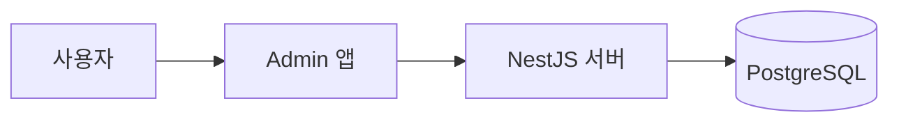
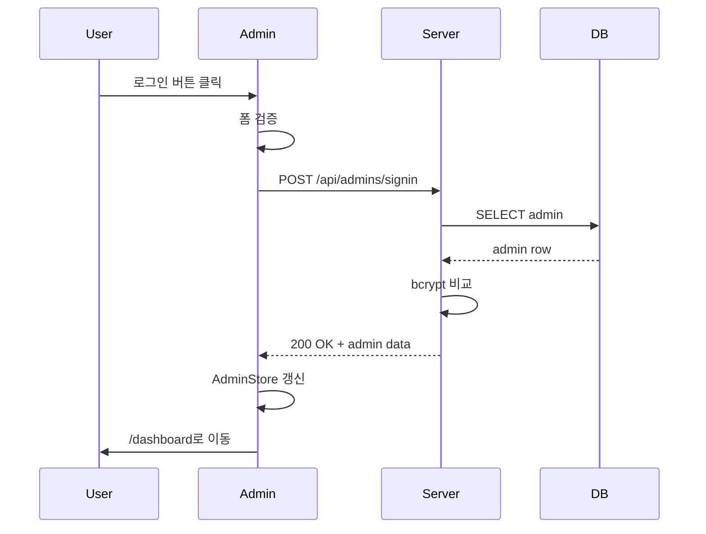
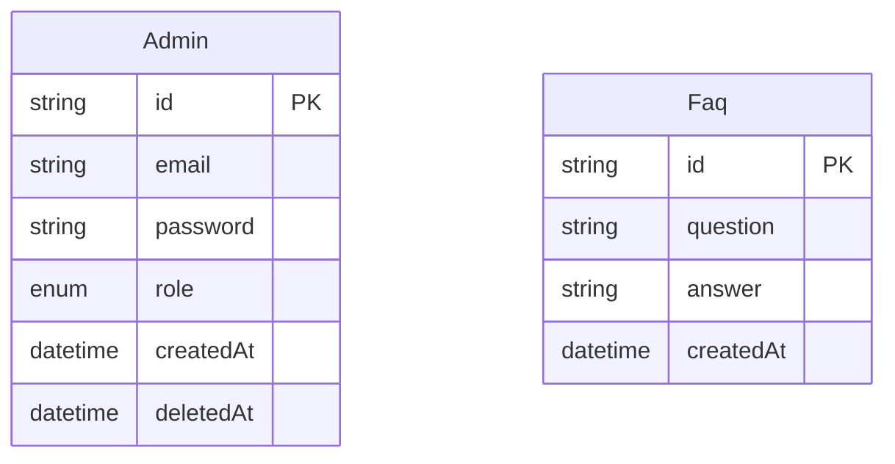

# GitHub 활용 팁 — 잘 안 알려진 기능들

이 문서는 **GitHub를 더 잘 활용할 수 있는 기능들**을 정리합니다. github.dev처럼 "와 이런 게 있었어?" 싶은 기능 위주. 핵심은 GitHub 자체 기능이고, Markdown 고급 문법은 GitHub가 지원하는 렌더링 기능입니다.

---

## 1. URL 트릭 — 도메인만 살짝 바꿔서 마법

### 1-1. `.` (마침표 키) → github.dev

저장소 페이지에서 마침표 `.` 누르기 → 브라우저에서 VSCode가 열림. 가벼운 코드 탐색/편집용.

### 1-2. github1s.com — 비슷한 도구

```
https://github.com/user/repo
→ https://github1s.com/user/repo
```

github.dev와 비슷하지만 별도 서비스. 코드 탐색만 빠르게 할 때.

### 1-3. raw.githubusercontent.com — 파일 원본 직접 접근

```
https://github.com/user/repo/blob/main/README.md
→ https://raw.githubusercontent.com/user/repo/main/README.md
```

markdown 파일이나 이미지를 다른 사이트에 임베드할 때 씀.

### 1-4. `?w=1` — 공백 무시한 diff

PR이나 commit URL 끝에 `?w=1` 붙이면 공백 변경은 무시하고 진짜 변경만 보임.

```
https://github.com/user/repo/pull/123/files?w=1
```

들여쓰기만 바꾼 PR을 검토할 때 매우 유용.

---

## 2. 키보드 단축키

### 2-1. `?` — 모든 단축키 한 번에 보기

> [!TIP]
> **GitHub 어떤 페이지에서든 `?` 누르면 그 페이지의 모든 단축키가 나옴.** 한 번 누르고 외워두면 평생 씀.

### 2-2. 자주 쓰는 단축키 모음

| 키 | 동작 | 어디서 동작 |
| --- | --- | --- |
| `.` | github.dev 열기 | 저장소 |
| `?` | 단축키 도움말 | 어디든 |
| `T` | 파일 빠른 찾기 (VSCode의 Ctrl+P처럼) | 저장소 |
| `L` | 특정 줄로 이동 | 파일 보기 |
| `Y` | 영구 링크 생성 | 파일 보기 |
| `/` | 검색 활성화 | 어디든 |
| `B` | git blame 보기 (누가 언제 이 줄 썼는지) | 파일 보기 |
| `W` | 브랜치 빠른 전환 | 저장소 |
| `S` | 사이트 검색 | 어디든 |

### 2-3. `Y` 키 — 영구 링크의 중요성

파일을 보고 있을 때 그냥 URL을 복사하면 보통 이런 식:
```
github.com/user/repo/blob/main/src/foo.ts#L10
```

`main` 브랜치는 계속 바뀌니까 나중에 그 줄이 사라지거나 이동하면 **링크가 다른 코드를 가리키게 됨**.

`Y`를 누르면 현재 커밋 해시가 들어간 URL로 바뀜:
```
github.com/user/repo/blob/abc123def/src/foo.ts#L10
```

→ 그 커밋의 해당 줄을 **영원히** 가리킴. 동료에게 "여기 봐줘"라고 할 때 필수.

---

## 3. Markdown 고급 문법

### 3-1. Alert 박스 (2023년 추가된 기능)

대부분 모름. GitHub에서 색깔 + 아이콘이 붙은 박스로 렌더링됨.

```markdown
> [!NOTE]
> 알아두면 좋은 정보

> [!TIP]
> 도움 되는 팁

> [!IMPORTANT]
> 중요한 내용

> [!WARNING]
> 경고

> [!CAUTION]
> 위험
```

활용 예 (이 프로젝트 학습 문서에 적용 시):

> [!TIP]
> 처음 보는 분이라면 [04-getting-started.md](04-getting-started.md)부터 읽으세요.

> [!WARNING]
> `docker-compose down -v`는 DB 데이터까지 모두 삭제합니다.

### 3-2. Mermaid 다이어그램 — 코드로 그림 그리기

ASCII 그림 대신 진짜 다이어그램을 그릴 수 있음.

````markdown

````

GitHub에서 보면 진짜 화살표가 있는 다이어그램으로 렌더링됨.

#### 지원되는 다이어그램 종류

| 종류 | 키워드 | 용도 |
| --- | --- | --- |
| 플로우차트 | `graph LR` 또는 `graph TD` | 흐름 표현 |
| 시퀀스 다이어그램 | `sequenceDiagram` | 시간 순서 상호작용 |
| 클래스 다이어그램 | `classDiagram` | OOP 클래스 관계 |
| ER 다이어그램 | `erDiagram` | DB 스키마 |
| 간트차트 | `gantt` | 일정 |
| 마인드맵 | `mindmap` | 아이디어 정리 |
| 상태 다이어그램 | `stateDiagram-v2` | 상태 전이 |

#### 이 프로젝트에 적용 예 — 시퀀스 다이어그램

[01-flow-walkthrough.md](01-flow-walkthrough.md)의 ASCII 다이어그램을 mermaid로 바꾸면:

````markdown

````

GitHub에서 화살표가 있는 진짜 시퀀스 다이어그램으로 보임.

#### ER 다이어그램 — DB 스키마 시각화

````markdown

````

### 3-3. Foldable section — 긴 내용 접기

```markdown
<details>
<summary>여기를 클릭해서 펼치기</summary>

여기 안에 긴 내용이 들어감.

코드 블록도 가능:
` ` `typescript
const example = '안녕';
` ` `

</details>
```

긴 코드 예시나 부가 설명을 접어둘 때 유용. 문서가 길어 보이지 않게 만듦.

### 3-4. Task list — 체크박스

```markdown
- [ ] 아직 안 한 일
- [x] 완료한 일
- [ ] 또 다른 일
```

이슈/PR/README 어디든 동작. 진행 상황 표시에 자주 씀.

### 3-5. 수식 (LaTeX)

```markdown
인라인 수식: $E = mc^2$

블록 수식:
$$
\sum_{i=1}^n i = \frac{n(n+1)}{2}
$$
```

수학/통계 관련 문서에 유용.

### 3-6. 색깔 표시 — `code`로 감싸기

```markdown
- 빨강: `#FF0000`
- 초록: `#00FF00`
```

색상 헥스코드를 backtick으로 감싸면 작은 색상 미리보기 박스가 옆에 표시됨.

### 3-7. 자동 링크된 키워드

PR/Issue 본문이나 commit 메시지에 다음 키워드를 쓰면:

| 키워드 | 효과 |
| --- | --- |
| `Closes #123` | PR이 머지되면 issue 123 자동으로 닫힘 |
| `Fixes #123` | 같음 |
| `Resolves #123` | 같음 |
| `@username` | 그 사용자에게 알림 |
| `#123` | 같은 저장소의 issue/PR로 자동 링크 |
| `user/repo#123` | 다른 저장소의 issue/PR로 링크 |

---

## 4. GitHub Codespaces — 클라우드 개발 환경

### 무엇인가

github.dev는 코드 읽기/편집만 되고 실행은 안 돼요. **Codespaces는 진짜 개발 환경 전체가 클라우드에서 돌아감.**

- 가벼운 노트북에서도 무거운 빌드/실행 가능
- 어디서든 같은 환경
- 무료 플랜: 월 60시간 (2-core 머신 기준, 개인 계정)

### 사용 방법

1. 저장소에서 "Code" 버튼 클릭
2. "Codespaces" 탭 선택
3. "Create codespace on main" 클릭
4. 몇 초 후 VSCode가 열림 (브라우저 또는 데스크톱 VSCode와 연결)
5. 진짜 터미널, 진짜 node/docker, 진짜 코드 실행 가능

### 자동 설정 — `.devcontainer/`

저장소에 `.devcontainer/devcontainer.json` 두면 Codespaces가 그대로 환경 구성:

```json
{
    "image": "mcr.microsoft.com/devcontainers/typescript-node:20",
    "features": {
        "ghcr.io/devcontainers/features/docker-in-docker:2": {},
        "ghcr.io/devcontainers/features/node:1": { "version": "20" }
    },
    "postCreateCommand": "pnpm install",
    "forwardPorts": [3000, 4200, 5432],
    "customizations": {
        "vscode": {
            "extensions": [
                "Prisma.prisma",
                "Angular.ng-template",
                "bradlc.vscode-tailwindcss"
            ]
        }
    }
}
```

이 프로젝트에 적용하면 codespace 켤 때 자동으로 pnpm install / docker compose 실행 + VSCode 확장 자동 설치.

> [!NOTE]
> 이 프로젝트에는 아직 `.devcontainer/`가 없어요. 필요해지면 추가 가능.

---

## 5. Profile README — 본인 프로필 꾸미기

### 방법

GitHub 사용자명과 **똑같은 이름의 저장소**를 만들고 그 안에 `README.md`를 두면, 사용자 프로필 페이지 상단에 그 README가 표시됨.

예시:
- 사용자명이 `lepisodejunhyun`이면
- → `lepisodejunhyun/lepisodejunhyun` 저장소 만들기
- → 그 안에 `README.md` 작성

### 활용 예

```markdown
# 안녕하세요 👋

저는 풀스택 개발자입니다.

## 사용 기술
- Frontend: Angular, React
- Backend: NestJS, Express
- DB: PostgreSQL, MongoDB

## 작업 중인 프로젝트
- [demo](https://github.com/lepisodejunhyun/demo) — 학습용 풀스택 프로젝트
```

이미지/배지/통계 카드 등 자유롭게.

### 인기 있는 GitHub 통계 카드

```markdown

```

→ 본인 활동 통계가 동적으로 표시됨.

---

## 6. PR 검토 도구

### 6-1. Suggested changes — 한 줄짜리 수정 제안

PR 코멘트에서 코드 블록 안에 ` ``` suggestion`이라고 적으면:

````markdown
```suggestion
const fixedCode = '제안된 코드';
```
````

PR 작성자가 클릭 한 번으로 그 변경을 받아들일 수 있음. 검토자가 "이렇게 바꿔주세요"하고 직접 제안 가능.

### 6-2. 라인 범위 코멘트

PR diff에서 줄 번호를 **드래그**하면 여러 줄에 걸친 코멘트 가능. 한 줄만 코멘트 가능한 게 아님.

### 6-3. Resolve conversation

PR 코멘트 스레드를 "Resolve conversation" 버튼으로 닫을 수 있음. 해결된 논의는 접혀서 가독성 향상.

### 6-4. Files changed 탭의 옵션

PR의 "Files changed" 탭 우측 톱니바퀴에서:
- **Hide whitespace**: `?w=1`과 동일
- **Split / Unified view**: 좌우 비교 / 위아래 비교 전환
- **Sort by**: 파일 정렬 기준

---

## 7. GitHub Code Search — 코드 전체 검색

GitHub 상단 검색창에서 코드 검색 가능. 새로운 검색 엔진 도입(2023) 후 매우 빨라짐.

### 자주 쓰는 검색 문법

```
language:typescript "useState"
repo:user/name NestFactory.create
path:**/*.controller.ts @Get
org:angular import OnInit
```

| 키워드 | 의미 |
| --- | --- |
| `language:typescript` | 특정 언어로 제한 |
| `repo:user/name` | 특정 저장소만 |
| `path:**/*.ts` | 특정 경로 패턴 |
| `org:기업명` | 특정 조직 |
| `extension:md` | 특정 확장자 |
| `"정확한 문구"` | 따옴표로 정확한 매치 |
| `keyword1 OR keyword2` | OR 조건 |
| `NOT keyword` | 제외 |

### 학습에 활용

다른 사람들이 같은 라이브러리를 어떻게 쓰는지 검색해보면 좋은 패턴 발견 가능:

```
language:typescript "@OnEvent" NestJS
```

---

## 8. `.github/` 폴더 — 특수 폴더

저장소 루트에 `.github/` 폴더를 만들면 안에 두는 파일들에 특별한 의미가 부여됨.

| 파일 | 효과 |
| --- | --- |
| `.github/workflows/*.yml` | GitHub Actions (CI/CD 자동화) |
| `.github/ISSUE_TEMPLATE/*.md` | 새 이슈 만들 때 자동으로 템플릿 선택 가능 |
| `.github/PULL_REQUEST_TEMPLATE.md` | PR 만들 때 본문에 자동 채워짐 |
| `.github/CODEOWNERS` | 특정 파일 변경 시 자동 리뷰어 지정 |
| `.github/FUNDING.yml` | 저장소 페이지에 Sponsor 버튼 표시 |
| `.github/dependabot.yml` | 의존성 자동 업데이트 PR 생성 |

### GitHub Actions 간단 예시

`.github/workflows/test.yml`:
```yaml
name: Test

on:
    push:
        branches: [main]
    pull_request:

jobs:
    test:
        runs-on: ubuntu-latest
        steps:
            - uses: actions/checkout@v4
            - uses: pnpm/action-setup@v2
            - run: pnpm install
            - run: pnpm nx run-many --target=test
```

→ main에 push되거나 PR 생성될 때마다 자동으로 테스트 실행.

---

## 9. 잘 안 알려진 GitHub 기능들

### 9-1. Stars 정렬 / 검색

자기가 별표 단 저장소들을 정리/검색 가능:
- `https://github.com/<자기이름>?tab=stars`
- 컬렉션(List)으로 분류도 가능

### 9-2. Discussions

Issues보다 가벼운 토론 공간 (Q&A, 아이디어 공유). 저장소 설정에서 활성화.

### 9-3. GitHub Pages

정적 사이트 무료 호스팅:
- `username.github.io` 저장소: 그 자체로 사이트
- 다른 저장소: Settings → Pages에서 활성화

학습 자료나 포트폴리오 사이트로 자주 씀.

### 9-4. Gist

짧은 코드 스니펫 공유. 미니 저장소처럼 작동. `gist.github.com` 접속.

### 9-5. Permalink을 이용한 코드 인용

`<>` 아이콘(Code reference) 클릭 → 다른 곳에 코드 임베드 가능.

### 9-6. Compare URLs

두 브랜치/태그/커밋을 직접 비교:
```
https://github.com/user/repo/compare/main...feature-branch
https://github.com/user/repo/compare/v1.0.0...v2.0.0
```

### 9-7. README 배지 (shields.io)

저장소 상태/버전을 시각적으로 표시:
```markdown


```

shields.io에서 원하는 배지 생성.

### 9-8. Pin Repositories

본인 프로필에서 강조하고 싶은 저장소 6개까지 핀 고정. 프로필 페이지 상단에 표시됨.

### 9-9. README 내 이미지에 다크모드 지원

```markdown
<picture>
    <source media="(prefers-color-scheme: dark)" srcset="dark.png">
    <source media="(prefers-color-scheme: light)" srcset="light.png">
    
</picture>
```

사용자의 GitHub 테마(light/dark)에 맞춰 자동으로 다른 이미지 표시.

---

## 10. 이 프로젝트에 바로 적용해볼 만한 것

> [!TIP]
> 사용자분 학습 환경 개선에 도움 될 만한 것들 정리:

### 우선순위 ★★★ (즉시 효과)

1. **Mermaid로 다이어그램 교체**
   - [01-flow-walkthrough.md](01-flow-walkthrough.md)의 ASCII 다이어그램을 mermaid로 → GitHub에서 시각적으로 훨씬 보기 좋음.
   - DB 스키마는 erDiagram으로 그리면 한눈에.

2. **Alert 박스 도입**
   - 모든 docs에 `> [!NOTE]`, `> [!TIP]`, `> [!WARNING]` 추가 → 중요 부분 강조.

3. **`?` 단축키 외우기**
   - 한 번 외우면 평생 씀.

### 우선순위 ★★☆ (가끔 유용)

4. **Profile README 만들기**
   - `lepisodejunhyun/lepisodejunhyun` 저장소.

5. **`.devcontainer/devcontainer.json`** — Codespaces 자동 설정
   - 카페에서도 학습 가능해짐.

### 우선순위 ★☆☆ (필요시)

6. **GitHub Actions** — 코드 푸시 시 자동 lint/test.

7. **README 배지** — 기술 스택 표시.

---

## 11. 추천 — 지금 당장 해보기

1. 아무 저장소 가서 `?` 눌러보기 → 모든 단축키 나옴.
2. 사용자분 docs 폴더 아무 파일에 `> [!TIP] 한 줄 메모` 추가하고 GitHub에 push → 어떻게 보이는지 확인.
3. Mermaid 다이어그램 한 개만 그려서 시각화 효과 체감.

---

## 12. 더 깊게 알아보기 (공식 문서)

- **GitHub Docs**: https://docs.github.com/
- **GitHub Markdown 가이드**: https://docs.github.com/en/get-started/writing-on-github
- **Codespaces 문서**: https://docs.github.com/en/codespaces
- **GitHub Actions 문서**: https://docs.github.com/en/actions
- **Mermaid 문법**: https://mermaid.js.org/
- **GitHub Skills (튜토리얼)**: https://skills.github.com/

> [!NOTE]
> GitHub Skills는 GitHub가 직접 만든 단계별 학습 코스. 실제 저장소에서 실습하면서 배우는 형식. 무료.
