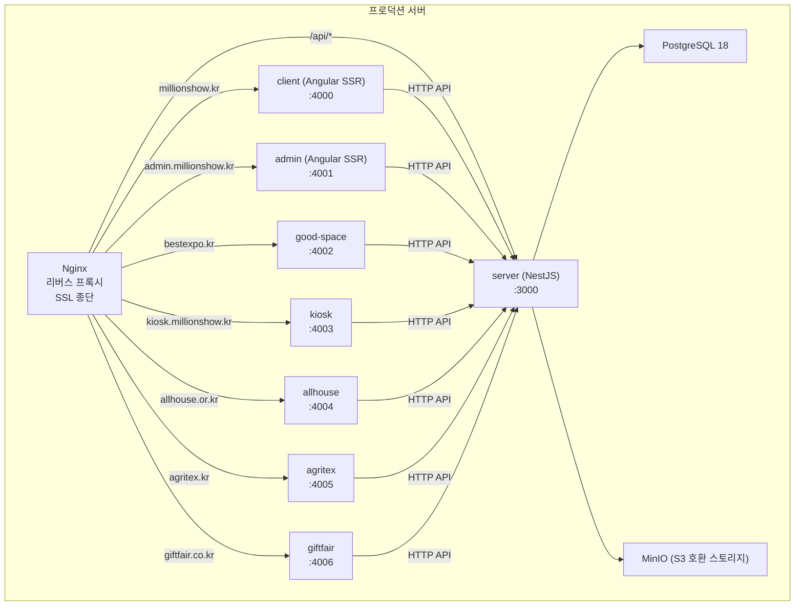
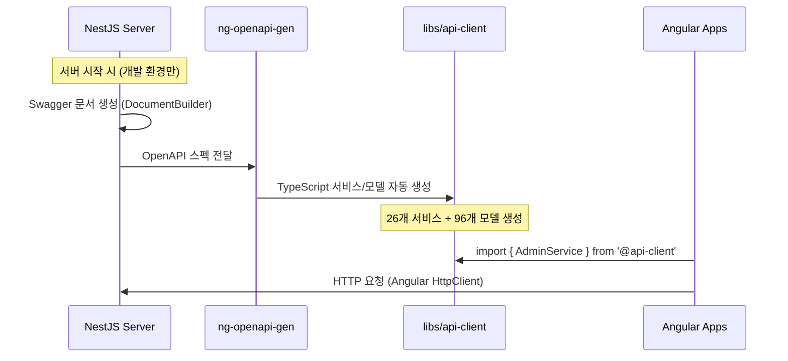
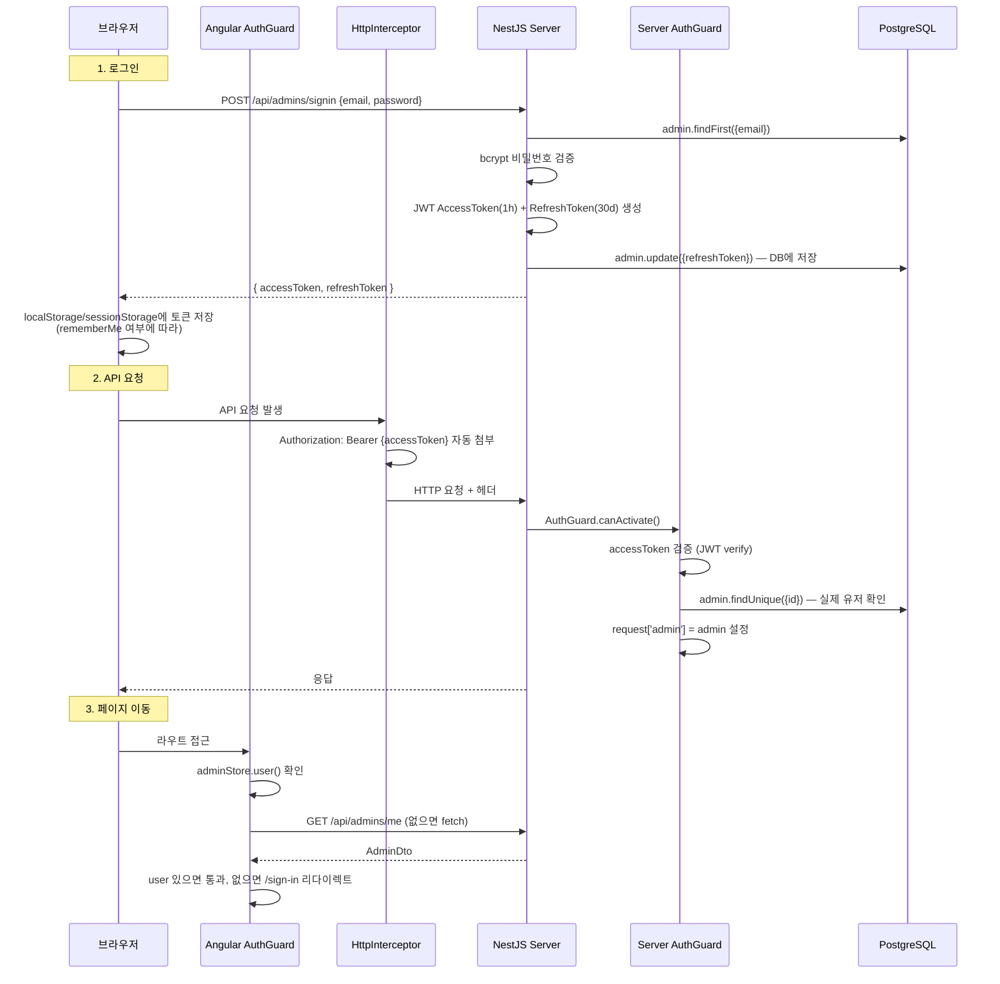
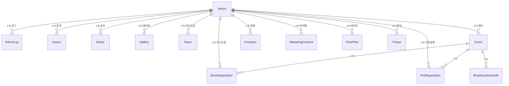

# millionshow-v2 프로젝트 전체 분석

## 📌 프로젝트 개요

**박람회/전시회 관리 플랫폼**. 하나의 NestJS 서버가 여러 박람회 사이트(client, good-space, allhouse, agritex, giftfair, startfair)와 관리자(admin), 키오스크(kiosk)를 통합 서비스하는 구조.

- **Nx 22 모노레포** (npm workspace)
- **백엔드**: NestJS 11 + Prisma 6 + PostgreSQL
- **프론트엔드**: Angular 20 SSR × 8개 앱
- **배포**: Docker + Nginx + NCP(Naver Cloud Platform)

---

## 🏗️ 전체 아키텍처



---

## 📁 프로젝트 구조

### Apps (10개)

| 앱 | 기술 | 도메인 | 포트 | 역할 |
|---|---|---|---|---|
| **server** | NestJS + Webpack | - | 3000 | API 백엔드 (30개 모듈) |
| **admin** | Angular SSR | admin.millionshow.kr | 4001 | 관리자 대시보드 |
| **client** | Angular SSR | millionshow.kr | 4000 | 메인 박람회 사이트 |
| **good-space** | Angular SSR | bestexpo.kr | 4002 | 좋은공간 박람회 |
| **kiosk** | Angular + Capacitor | kiosk.millionshow.kr | 4003 | 현장 키오스크 (Android) |
| **allhouse** | Angular SSR | allhouse.or.kr | 4004 | 올하우스 가구박람회 |
| **agritex** | Angular SSR | agritex.kr | 4005 | 어그리텍스 |
| **giftfair** | Angular SSR | giftfair.co.kr | 4006 | 기프트페어 |
| **startfair** | Angular SSR | startfair.net | 4007 | 스타트페어 |
| **server-e2e** | Jest | - | - | API 테스트 |

### Libs (3개)

| 라이브러리 | 경로 별칭 | 용도 | 사용처 |
|---|---|---|---|
| **api-client** | `@api-client` | `ng-openapi-gen` 자동 생성 API 클라이언트 (Angular HttpClient 기반) | 모든 Angular 앱 |
| **common** | `@common` | 상수, 타입, 유틸 함수 (토큰 키, 역할, 포맷터 등) | server + 모든 Angular 앱 |
| **client-libs** | `@client-libs` | Angular 공유 컴포넌트, 디렉티브, 파이프, 서비스, 스토어, 애니메이션 | 모든 Angular 앱 |

---

## 🔗 서버 ↔ 프론트엔드 연결 방식

### API 클라이언트 자동 생성 흐름



> [!IMPORTANT]
> demo 프로젝트에서는 `@hey-api/openapi-ts`를 사용하지만, millionshow-v2에서는 `ng-openapi-gen`을 사용합니다.
> 핵심 차이: `ng-openapi-gen`은 Angular의 `HttpClient` + `Observable` 기반 서비스를 생성하고, `@hey-api/openapi-ts`는 프레임워크 무관한 fetch 기반 SDK를 생성합니다.

### API 클라이언트 연결 설정

```typescript
// apps/admin/src/app/app.config.ts
appConfig = {
  providers: [
    provideHttpClient(withFetch(), withInterceptors([HttpInterceptor])),
    importProvidersFrom(
      ApiModule.forRoot({
        rootUrl: environment.baseUrl,  // 환경별 API URL
      })
    ),
  ],
};
```

### 자동 생성 결과물 (`libs/api-client/src/lib/`)

| 파일 | 개수 | 내용 |
|---|---|---|
| `services/*.service.ts` | 26개 | AdminService, EventService, GalleryService 등 |
| `models/*.ts` | 96개 | AdminDto, CreateAdminDto, EventDto 등 |
| `api.module.ts` | 1개 | Angular ApiModule (루트 설정) |
| `fn/*.ts` | - | 각 API 함수 |

---

## 🔐 인증(JWT) 흐름

### 전체 인증 아키텍처



### 서버 측 인증 (NestJS)

| 파일 | 역할 |
|---|---|
| [auth.module.ts](file:///c:/workspace/millionshow-v2/apps/server/src/app/auth/auth.module.ts) | `@Global()` JWT 모듈 등록 (secret: env) |
| [auth.util.ts](file:///c:/workspace/millionshow-v2/apps/server/src/app/auth/auth.util.ts) | 토큰 생성/검증/비교, 헤더에서 토큰 추출 |
| [auth.guard.ts](file:///c:/workspace/millionshow-v2/apps/server/src/app/auth/guards/auth.guard.ts) | `CanActivate` — Access Token 검증 + DB 관리자 확인 |
| [optional.guard.ts](file:///c:/workspace/millionshow-v2/apps/server/src/app/auth/guards/optional.guard.ts) | 토큰 있으면 검증, 없어도 통과 |
| `@Auth()` 데코레이터 | 인증 필요 엔드포인트에 간편 적용 |
| `@GetAdmin()` 데코레이터 | `request['admin']`에서 관리자 객체 추출 |

### 프론트 측 인증 (Angular admin)

| 파일 | 역할 |
|---|---|
| [auth.guard.ts](file:///c:/workspace/millionshow-v2/apps/admin/src/app/guards/auth.guard.ts) | `CanActivateFn` — user 없으면 fetch 시도, 실패 시 /sign-in |
| [http-interceptor.ts](file:///c:/workspace/millionshow-v2/apps/admin/src/app/libs/http-interceptor.ts) | 모든 HTTP 요청에 Access Token 자동 첨부 |
| [admin.store.ts](file:///c:/workspace/millionshow-v2/apps/admin/src/app/stores/admin.store.ts) | Signal 기반 상태관리 — fetch, setUser, clearUser, logout |
| [sign-in.page.ts](file:///c:/workspace/millionshow-v2/apps/admin/src/app/pages/auth/sign-in/sign-in.page.ts) | 로그인 폼 — rememberMe로 localStorage/sessionStorage 분기 |

---

## 🗄️ 데이터베이스 (Prisma)

### 스키마 구조

- 메인 스키마: `prisma/schema.prisma` (PostgreSQL 설정)
- 모델 파일: `prisma/models/` — **32개 파일**로 분리

### 주요 모델 관계



### 모델 목록 (32개)

| 카테고리 | 모델 |
|---|---|
| **사용자** | Admin, AdminLog |
| **행사** | Event, Place, BoothApplication, BoothOption, BoothOptionTemplate, BroadcastSchedule, FloorPlan, Exhibitor |
| **업체** | Company |
| **콘텐츠** | Notice, News, Gallery, DonationGallery, Faq, History, HeroBanner, Banner, Popup |
| **고객** | Inquiry, PreRegistration, MarketingConsent, Visitor, Sponsor |
| **시스템** | Setting, Policy, File, AlimTalkLog, BackgroundTaskLog, AdminLog |
| **기타** | SourceType, Task |

---

## 🖥️ NestJS 서버 상세 (30개 모듈)

### main.ts 주요 설정

| 설정 | 내용 |
|---|---|
| CORS | `origin: true` (모든 출처 허용) |
| Body 크기 | JSON 500MB, URLEncoded 100MB |
| 보안 | Helmet (CSP, XSS 방어) |
| 압축 | compression 미들웨어 |
| 로깅 | Morgan (dev 모드) |
| 글로벌 프리픽스 | `/api` |
| API 버저닝 | `enableVersioning()` |
| Swagger | `/reference` (Scalar) |
| API 클라이언트 | 개발 환경에서 서버 시작 시 자동 생성 |
| ValidationPipe | transform + whitelist + 커스텀 에러 메시지 |

### 주요 모듈 구성

```
AppModule
├── PrismaModule (@Global)
├── AuthModule (@Global) — JWT, Guards
├── ScheduleModule — 스케줄링
├── EventEmitterModule — 이벤트 처리
├── StorageModule — MinIO/S3 파일 업로드
├── NCPAlimTalkModule — 네이버 클라우드 알림톡
├── AdminModule — 관리자 CRUD + 로그인/로그아웃
├── EventModule — 행사 관리
├── CompanyModule — 업체 관리
├── BoothApplicationModule — 부스 신청
├── ExcelModule — 엑셀 다운로드
├── GalleryModule — 갤러리
├── NoticeModule, NewsModule, FaqModule — 게시판
├── InquiryModule — 문의
├── PopupModule, HeroBannerModule — UI 관리
├── ... (30개 모듈)
└── AdminLogInterceptor (APP_INTERCEPTOR) — 관리자 활동 로깅
```

### Admin API 엔드포인트 (완전 구현)

| 메서드 | 경로 | 인증 | 설명 |
|---|---|---|---|
| `GET` | `/api/admins` | ❌ | 관리자 전체 조회 |
| `GET` | `/api/admins/me` | ✅ `@Auth()` | 현재 로그인 관리자 조회 |
| `GET` | `/api/admins/search/offset` | ❌ | 오프셋 기반 페이지네이션 |
| `GET` | `/api/admins/search/cursor` | ❌ | 커서 기반 페이지네이션 |
| `GET` | `/api/admins/:id` | ❌ | ID로 관리자 조회 |
| `GET` | `/api/admins/:id/logs` | ❌ | 관리자 활동 로그 조회 |
| `POST` | `/api/admins` | ❌ | 관리자 생성 |
| `POST` | `/api/admins/signin` | ❌ | 로그인 (JWT 발급) |
| `POST` | `/api/admins/signup` | ❌ | 회원가입 |
| `POST` | `/api/admins/refresh` | ✅ `@Auth()` | 토큰 갱신 |
| `POST` | `/api/admins/logout` | ✅ `@Auth()` | 로그아웃 (refreshToken null) |
| `PATCH` | `/api/admins/:id` | ❌ | 관리자 수정 |
| `DELETE` | `/api/admins/:id` | ❌ | 소프트 삭제 (email 변경 + deletedAt) |

---

## 🎨 Angular Admin 앱 상세

### 라우팅 구조 (2,918줄)

서브 도메인별로 **레이아웃을 분리**하는 구조:

```
/ → /dashboard (리다이렉트)
/sign-in → SignInPage (가드 없음)

DefaultLayout (authGuard 적용)
├── /dashboard — 대시보드
├── /event — 행사 관리 (CRUD)
├── /marketing — 마케팅 동의, 알림톡
├── /board — 갤러리, 보도자료
├── /site — 사업자 정보, 로고, 약관, 팝업, 배너
├── /customer — FAQ, 공지, 문의
├── /broadcast-schedule — 방송 스케줄
├── /admin — 관리자 관리
└── /my-page — 마이페이지

EventLayout (/event/:eventId)
├── /dashboard — 행사별 대시보드
├── /floor-plan — 배치도
├── /booth-application — 참가 신청
└── /pre-registration — 사전 등록

GoodspaceLayout (/good-space) — bestexpo.kr 전용
StartfairLayout (/startfair)
AllhouseLayout (/allhouse)
AgritexLayout (/agritex)
GiftfairLayout (/giftfair)
```

### 공유 인프라

| 영역 | 파일 | 역할 |
|---|---|---|
| 상태관리 | `stores/admin.store.ts` | BaseStore 상속, Signal 기반, fetch/logout |
| | `stores/event.store.ts` | 현재 선택된 행사 상태 |
| HTTP | `libs/http-interceptor.ts` | 토큰 자동 첨부, 에러 핸들링 |
| UI | `@client-libs` | Fieldset, Checkbox, Icon, ToastService 등 |
| CSS | TailwindCSS 4 + DaisyUI 5 | 유틸리티 CSS + 컴포넌트 |

---

## 🐳 배포 파이프라인

### Docker 이미지 (3종)

| Dockerfile | 용도 | 베이스 |
|---|---|---|
| `Dockerfile.server` | NestJS 서버 | node:25-alpine |
| `Dockerfile.node` | Angular SSR 앱 (7개) | node:alpine |
| `Dockerfile.nginx` | Kiosk (정적 빌드) | nginx |

### 배포 흐름

```
nx build [앱] → Docker 이미지 빌드 (linux/amd64)
→ NCP Container Registry 푸시 → Portainer Webhook 트리거
→ 서버에서 새 이미지 pull → 컨테이너 재시작
```

### Nginx 리버스 프록시 (도메인 라우팅)

| 도메인 | 포트 | 앱 |
|---|---|---|
| millionshow.kr `/api/*` | → :3000 | server |
| millionshow.kr `/` | → :4000 | client |
| admin.millionshow.kr | → :4001 | admin |
| bestexpo.kr | → :4002 | good-space |
| kiosk.millionshow.kr | → :4003 | kiosk |
| allhouse.or.kr | → :4004 | allhouse |
| agritex.kr | → :4005 | agritex |
| giftfair.co.kr | → :4006 | giftfair |

> 모든 도메인 HTTPS (Let's Encrypt SSL) + HTTP→HTTPS 리다이렉트

---

## 🔄 demo vs millionshow-v2 비교

| 항목 | demo | millionshow-v2 |
|---|---|---|
| **규모** | 서버 1개 + 앱 1개 | 서버 1개 + 앱 8개 |
| **API 클라이언트** | `@hey-api/openapi-ts` (fetch) | `ng-openapi-gen` (Angular HttpClient) |
| **인증** | ❌ 없음 | ✅ JWT (Access + Refresh) |
| **DB 모델** | 1개 (Admin) | 32개 |
| **서버 모듈** | 2개 (Admin, Prisma) | 30개 |
| **라우팅** | 빈 배열 | 2,918줄 (멀티 레이아웃) |
| **배포** | 없음 | Docker + NCP + Nginx |
| **UI** | 없음 | TailwindCSS + DaisyUI |
| **파일 업로드** | 없음 | MinIO (S3 호환) |
| **알림** | 없음 | NCP 알림톡 |
| **키오스크** | 없음 | Capacitor (Android) |
| **로깅** | EventEmitter 로그 | AdminLogInterceptor 전역 |
| **Prisma 연결** | `@prisma/adapter-pg` | `PrismaClient` 직접 |

---

## 📊 핵심 패턴 요약

### 데이터 흐름 (프론트 → 서버 → DB)

```
Angular Component
  → inject(AdminService)           // @api-client의 자동생성 서비스
  → adminService.adminControllerSignin({body})  // Observable 반환
  → HttpInterceptor가 토큰 첨부    // Authorization: Bearer ...
  → NestJS Controller 수신         // @Body() data: AdminSignInDTO
  → ValidationPipe 검증            // class-validator
  → Service 비즈니스 로직           // bcrypt 비교, JWT 생성
  → PrismaService DB 조회/수정     // findFirst, update
  → plainToInstance(AdminDTO)      // @Exclude/@Expose 직렬화
  → 응답 반환
```

### 인증이 걸린 요청 흐름

```
Angular AuthGuard (라우트 접근)
  → AdminStore.fetch()              // GET /api/admins/me
  → HttpInterceptor → 토큰 첨부
  → NestJS @Auth() → AuthGuard
  → JWT 검증 + DB 관리자 확인
  → request['admin'] = admin
  → @GetAdmin() → 관리자 객체 주입
```
